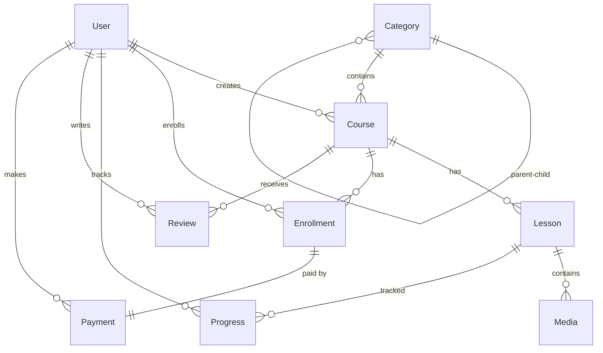

# Database Schema Documentation

Tài liệu mô tả thiết kế cơ sở dữ liệu cho nền tảng E-Learning.

## Overview

| Model | Table Name | Mô tả |
|-------|------------|-------|
| User | `users` | Người dùng (học viên, giảng viên, admin) |
| Category | `categories` | Danh mục khóa học (hỗ trợ cây phân cấp) |
| Course | `courses` | Khóa học |
| Lesson | `lessons` | Bài học trong khóa học |
| Media | `media` | Video/tài liệu đính kèm |
| Enrollment | `enrollments` | Ghi danh học viên vào khóa học |
| Payment | `payments` | Thanh toán |
| Progress | `progress` | Tiến độ học của user (POST-MVP) |
| Review | `reviews` | Đánh giá khóa học (POST-MVP) |

---

## Entity Relationship Diagram



---

## Enums

### Role
```prisma
enum Role {
  USER        // Học viên
  INSTRUCTOR  // Giảng viên
  ADMIN       // Quản trị viên
}
```

### CourseStatus
```prisma
enum CourseStatus {
  DRAFT       // Đang soạn
  PENDING     // Chờ duyệt
  PUBLISHED   // Đã xuất bản
  ARCHIVED    // Đã lưu trữ
}
```

### EnrollmentStatus
```prisma
enum EnrollmentStatus {
  PENDING     // Chờ thanh toán
  ACTIVE      // Đang học
  COMPLETED   // Hoàn thành
  EXPIRED     // Hết hạn
  REFUNDED    // Đã hoàn tiền
}
```

### PaymentStatus
```prisma
enum PaymentStatus {
  PENDING     // Chờ thanh toán
  COMPLETED   // Đã thanh toán
  FAILED      // Thất bại
  REFUNDED    // Đã hoàn tiền
}
```

### LessonType / MediaType
```prisma
enum LessonType { VIDEO, DOCUMENT }
enum MediaType { VIDEO, DOCUMENT, IMAGE }
```

---

## Models Detail

### User
Người dùng hệ thống, xác thực qua Firebase Auth.

| Column | Type | Constraint | Mô tả |
|--------|------|------------|-------|
| id | Int | PK, Auto | ID nội bộ |
| firebase_uid | String | Unique | Firebase UID |
| email | String | Unique | Email đăng nhập |
| name | String? | - | Họ tên |
| bio | String? | - | Mô tả bản thân (instructor) |
| photo_url | String? | - | Avatar URL |
| email_verified | Boolean | Default: false | Đã xác thực email |
| role | Role | Default: USER | Vai trò |
| created_at | DateTime | Auto | Ngày tạo |
| updated_at | DateTime | Auto | Ngày cập nhật |

**Indexes:** `email`, `firebase_uid`

---

### Category
Danh mục khóa học với hỗ trợ cây phân cấp (self-referencing).

| Column | Type | Constraint | Mô tả |
|--------|------|------------|-------|
| id | Int | PK | - |
| name | String | - | Tên danh mục |
| slug | String | Unique | URL-friendly slug |
| description | String? | - | Mô tả |
| icon | String? | - | Icon class/URL |
| parent_id | Int? | FK → Category | Parent category |
| order | Int | Default: 0 | Thứ tự sắp xếp |
| is_active | Boolean | Default: true | Trạng thái |

**Indexes:** `slug`

---

### Course
Khóa học do Instructor tạo.

| Column | Type | Constraint | Mô tả |
|--------|------|------------|-------|
| id | Int | PK | - |
| title | String | - | Tiêu đề khóa học |
| slug | String | Unique | URL slug |
| description | String | - | Mô tả chi tiết |
| short_desc | String? | - | Mô tả ngắn |
| thumbnail | String? | - | Ảnh thumbnail (R2 URL) |
| price | Decimal(10,2) | - | Giá gốc |
| discount_price | Decimal(10,2)? | - | Giá khuyến mãi |
| status | CourseStatus | Default: DRAFT | Trạng thái |
| level | String? | - | Beginner/Intermediate/Advanced |
| duration | Int | Default: 0 | Tổng thời lượng (phút) |
| instructor_id | Int | FK → User | Giảng viên |
| category_id | Int? | FK → Category | Danh mục |
| published_at | DateTime? | - | Ngày xuất bản |

**Indexes:** `slug`, `status`, `instructor_id`

---

### Lesson
Bài học trong khóa học.

| Column | Type | Constraint | Mô tả |
|--------|------|------------|-------|
| id | Int | PK | - |
| title | String | - | Tiêu đề bài học |
| slug | String | Unique per course | URL slug |
| description | String? | - | Mô tả |
| type | LessonType | Default: VIDEO | Loại bài học |
| content | String? | - | Nội dung text (cho DOCUMENT) |
| order | Int | Default: 0 | Thứ tự trong course |
| duration | Int | Default: 0 | Thời lượng (phút) |
| is_free | Boolean | Default: false | Bài học miễn phí |
| is_published | Boolean | Default: false | Đã xuất bản |
| course_id | Int | FK → Course | Khóa học |

**Unique:** `[course_id, slug]`
**Indexes:** `course_id`
**On Delete Course:** Cascade

---

### Media
Video/tài liệu đính kèm bài học.

| Column | Type | Constraint | Mô tả |
|--------|------|------------|-------|
| id | Int | PK | - |
| type | MediaType | - | VIDEO/DOCUMENT/IMAGE |
| title | String? | - | Tiêu đề |
| url | String | - | Bunny Stream hoặc R2 URL |
| filename | String? | - | Tên file gốc |
| mime_type | String? | - | MIME type |
| size | Int? | - | Dung lượng (bytes) |
| duration | Int? | - | Thời lượng video (giây) |
| order | Int | Default: 0 | Thứ tự |
| lesson_id | Int | FK → Lesson | Bài học |

**Indexes:** `lesson_id`
**On Delete Lesson:** Cascade

---

### Enrollment
Ghi danh học viên vào khóa học.

| Column | Type | Constraint | Mô tả |
|--------|------|------------|-------|
| id | Int | PK | - |
| status | EnrollmentStatus | Default: PENDING | Trạng thái |
| enrolled_at | DateTime | Auto | Ngày đăng ký |
| expires_at | DateTime? | - | Ngày hết hạn |
| completed_at | DateTime? | - | Ngày hoàn thành |
| progress_percent | Int | Default: 0 | % hoàn thành (denormalized) |
| user_id | Int | FK → User | Học viên |
| course_id | Int | FK → Course | Khóa học |

**Unique:** `[user_id, course_id]`
**Indexes:** `user_id`, `course_id`

---

### Payment
Thanh toán qua PayOS.

| Column | Type | Constraint | Mô tả |
|--------|------|------------|-------|
| id | Int | PK | - |
| amount | Decimal(10,2) | - | Số tiền |
| currency | String | Default: VND | Đơn vị tiền tệ |
| status | PaymentStatus | Default: PENDING | Trạng thái |
| method | String? | - | payos, vnpay, etc. |
| transaction_id | String? | Unique | Mã giao dịch gateway |
| payment_data | Json? | - | Response từ gateway |
| paid_at | DateTime? | - | Thời điểm thanh toán |
| user_id | Int | FK → User | Người thanh toán |
| enrollment_id | Int | Unique, FK → Enrollment | Ghi danh |

**Indexes:** `user_id`, `status`

---

### Progress (POST-MVP)
Tiến độ học của user trên từng lesson.

| Column | Type | Constraint | Mô tả |
|--------|------|------------|-------|
| id | Int | PK | - |
| is_completed | Boolean | Default: false | Đã hoàn thành |
| watched_seconds | Int | Default: 0 | Số giây đã xem |
| last_position | Int | Default: 0 | Vị trí resume |
| completed_at | DateTime? | - | Thời điểm hoàn thành |
| user_id | Int | FK → User | Học viên |
| lesson_id | Int | FK → Lesson | Bài học |

**Unique:** `[user_id, lesson_id]`

---

### Review (POST-MVP)
Đánh giá khóa học.

| Column | Type | Constraint | Mô tả |
|--------|------|------------|-------|
| id | Int | PK | - |
| rating | Int | - | Điểm 1-5 |
| comment | String? | - | Nhận xét |
| is_approved | Boolean | Default: false | Đã duyệt |
| user_id | Int | FK → User | Người đánh giá |
| course_id | Int | FK → Course | Khóa học |

**Unique:** `[user_id, course_id]` (1 review/user/course)

---

## Common Queries

### Lấy khóa học Published với Instructor
```sql
SELECT c.*, u.name as instructor_name
FROM courses c
JOIN users u ON c.instructor_id = u.id
WHERE c.status = 'PUBLISHED'
ORDER BY c.published_at DESC;
```

### Khóa học của user đã đăng ký
```sql
SELECT c.*, e.progress_percent, e.status as enrollment_status
FROM enrollments e
JOIN courses c ON e.course_id = c.id
WHERE e.user_id = $userId AND e.status = 'ACTIVE';
```

### Tiến độ học theo course
```sql
SELECT l.id, l.title, p.is_completed, p.watched_seconds
FROM lessons l
LEFT JOIN progress p ON l.id = p.lesson_id AND p.user_id = $userId
WHERE l.course_id = $courseId
ORDER BY l.order;
```

---

## Seed Data

Chạy seed để tạo dữ liệu test:

```bash
npm run db:seed
# hoặc
npx prisma db seed
# hoặc trực tiếp
npx tsx prisma/seed.ts
```

Seed bao gồm (dữ liệu realistic cho pagination/performance testing):
- **11 Categories** (5 main + 6 subcategories)
- **40 Users** (8 instructors, 32 students)
- **31 Courses** (~80% published, đa dạng giá và level)
- **603 Lessons** (12-26 lessons per course, 85% video, 15% documents)
- **516 Media** files (video references)
- **174 Enrollments** (mỗi student 2-8 courses)
- **174 Payments** (PayOS, VNPay, MoMo methods)
- **1915 Progress** records (tiến độ học đa dạng)
- **57 Reviews** (rating 3-5 sao)
