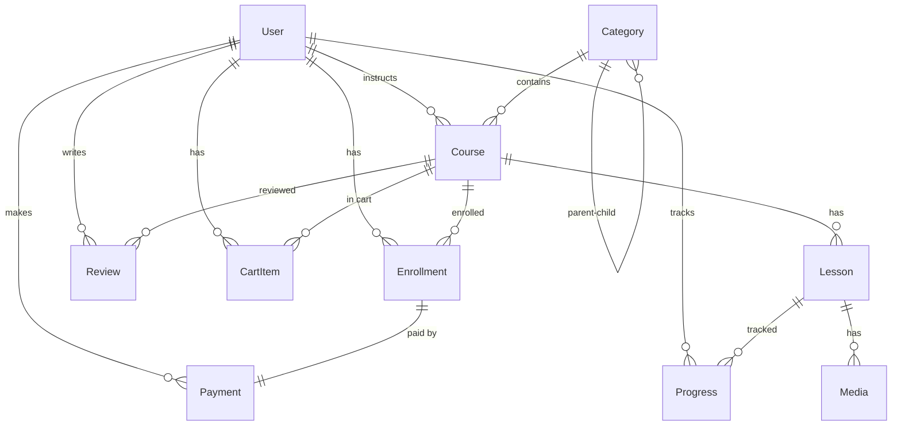

# 🗄️ Database Schema

> **Database:** PostgreSQL  
> **ORM:** Prisma 7.1.0  
> **Total Tables:** 11

---

## 📊 Entity Relationship Diagram



---

## 📋 Enums

### Role

| Value | Description |
|-------|-------------|
| `USER` | Regular student user |
| `INSTRUCTOR` | Can create and manage courses |
| `ADMIN` | Full system access |

### CourseStatus

| Value | Description |
|-------|-------------|
| `DRAFT` | Work in progress |
| `PENDING` | Awaiting admin approval |
| `PUBLISHED` | Live and visible |
| `ARCHIVED` | Hidden from listings |

### EnrollmentStatus

| Value | Description |
|-------|-------------|
| `PENDING` | Payment in progress |
| `ACTIVE` | Enrolled and learning |
| `COMPLETED` | Course finished |
| `EXPIRED` | Access expired |
| `REFUNDED` | Payment refunded |

### PaymentStatus

| Value | Description |
|-------|-------------|
| `PENDING` | Awaiting payment |
| `COMPLETED` | Payment successful |
| `FAILED` | Payment failed |
| `REFUNDED` | Money returned |

### MediaType

| Value | Description |
|-------|-------------|
| `VIDEO` | Video file |
| `DOCUMENT` | PDF, Word, etc. |
| `IMAGE` | Image file |
| `YOUTUBE_EMBED` | YouTube video |

### LessonType

| Value | Description |
|-------|-------------|
| `VIDEO` | Video lesson |
| `DOCUMENT` | Document lesson |

---

## 📦 Tables

### 1. User

```sql
TABLE users (
  id            SERIAL PRIMARY KEY,
  firebase_uid  VARCHAR UNIQUE NOT NULL,
  email         VARCHAR UNIQUE NOT NULL,
  name          VARCHAR,
  email_verified BOOLEAN DEFAULT FALSE,
  photo_url     VARCHAR,
  bio           TEXT,
  role          Role DEFAULT 'USER',
  created_at    TIMESTAMP DEFAULT NOW(),
  updated_at    TIMESTAMP
)

INDEX: email, firebase_uid
```

---

### 2. Category

```sql
TABLE categories (
  id          SERIAL PRIMARY KEY,
  name        VARCHAR NOT NULL,
  slug        VARCHAR UNIQUE NOT NULL,
  description TEXT,
  icon        VARCHAR,
  parent_id   INT REFERENCES categories(id),
  order       INT DEFAULT 0,
  is_active   BOOLEAN DEFAULT TRUE,
  created_at  TIMESTAMP DEFAULT NOW(),
  updated_at  TIMESTAMP
)

INDEX: slug
RELATION: Self-referencing for hierarchical categories
```

---

### 3. Course

```sql
TABLE courses (
  id             SERIAL PRIMARY KEY,
  title          VARCHAR NOT NULL,
  slug           VARCHAR UNIQUE NOT NULL,
  description    TEXT NOT NULL,
  short_desc     VARCHAR,
  thumbnail      VARCHAR,
  price          DECIMAL(10,2) NOT NULL,
  discount_price DECIMAL(10,2),
  status         CourseStatus DEFAULT 'DRAFT',
  level          VARCHAR,
  duration       INT DEFAULT 0,
  instructor_id  INT REFERENCES users(id) NOT NULL,
  category_id    INT REFERENCES categories(id),
  published_at   TIMESTAMP,
  created_at     TIMESTAMP DEFAULT NOW(),
  updated_at     TIMESTAMP
)

INDEX: slug, status, instructor_id
```

---

### 4. Lesson

```sql
TABLE lessons (
  id           SERIAL PRIMARY KEY,
  title        VARCHAR NOT NULL,
  slug         VARCHAR NOT NULL,
  description  TEXT,
  type         LessonType DEFAULT 'VIDEO',
  content      TEXT,
  order        INT DEFAULT 0,
  duration     INT DEFAULT 0,
  is_free      BOOLEAN DEFAULT FALSE,
  is_published BOOLEAN DEFAULT FALSE,
  course_id    INT REFERENCES courses(id) ON DELETE CASCADE NOT NULL,
  created_at   TIMESTAMP DEFAULT NOW(),
  updated_at   TIMESTAMP
)

INDEX: course_id
UNIQUE: (course_id, slug)
```

---

### 5. Media

```sql
TABLE media (
  id        SERIAL PRIMARY KEY,
  type      MediaType NOT NULL,
  title     VARCHAR,
  url       VARCHAR NOT NULL,
  filename  VARCHAR,
  mime_type VARCHAR,
  size      INT,
  duration  INT,
  order     INT DEFAULT 0,
  lesson_id INT REFERENCES lessons(id) ON DELETE CASCADE NOT NULL,
  created_at TIMESTAMP DEFAULT NOW(),
  updated_at TIMESTAMP
)

INDEX: lesson_id
```

---

### 6. Enrollment

```sql
TABLE enrollments (
  id               SERIAL PRIMARY KEY,
  status           EnrollmentStatus DEFAULT 'PENDING',
  enrolled_at      TIMESTAMP DEFAULT NOW(),
  expires_at       TIMESTAMP,
  completed_at     TIMESTAMP,
  progress_percent INT DEFAULT 0,
  user_id          INT REFERENCES users(id) NOT NULL,
  course_id        INT REFERENCES courses(id) NOT NULL,
  created_at       TIMESTAMP DEFAULT NOW(),
  updated_at       TIMESTAMP
)

INDEX: user_id, course_id
UNIQUE: (user_id, course_id)
```

---

### 7. Payment

```sql
TABLE payments (
  id             SERIAL PRIMARY KEY,
  amount         DECIMAL(10,2) NOT NULL,
  currency       VARCHAR DEFAULT 'VND',
  status         PaymentStatus DEFAULT 'PENDING',
  method         VARCHAR,
  transaction_id VARCHAR UNIQUE,
  payment_data   JSONB,
  user_id        INT REFERENCES users(id) NOT NULL,
  enrollment_id  INT UNIQUE REFERENCES enrollments(id) NOT NULL,
  paid_at        TIMESTAMP,
  created_at     TIMESTAMP DEFAULT NOW(),
  updated_at     TIMESTAMP
)

INDEX: user_id, status
```

---

### 8. Progress

```sql
TABLE progress (
  id              SERIAL PRIMARY KEY,
  is_completed    BOOLEAN DEFAULT FALSE,
  watched_seconds INT DEFAULT 0,
  last_position   INT DEFAULT 0,
  completed_at    TIMESTAMP,
  user_id         INT REFERENCES users(id) NOT NULL,
  lesson_id       INT REFERENCES lessons(id) ON DELETE CASCADE NOT NULL,
  created_at      TIMESTAMP DEFAULT NOW(),
  updated_at      TIMESTAMP
)

INDEX: user_id
UNIQUE: (user_id, lesson_id)
```

---

### 9. Review

```sql
TABLE reviews (
  id          SERIAL PRIMARY KEY,
  rating      INT NOT NULL,
  comment     TEXT,
  is_approved BOOLEAN DEFAULT FALSE,
  user_id     INT REFERENCES users(id) NOT NULL,
  course_id   INT REFERENCES courses(id) ON DELETE CASCADE NOT NULL,
  created_at  TIMESTAMP DEFAULT NOW(),
  updated_at  TIMESTAMP
)

INDEX: course_id
UNIQUE: (user_id, course_id)
```

---

### 10. CartItem

```sql
TABLE cart_items (
  id        SERIAL PRIMARY KEY,
  user_id   INT REFERENCES users(id) ON DELETE CASCADE NOT NULL,
  course_id INT REFERENCES courses(id) ON DELETE CASCADE NOT NULL,
  added_at  TIMESTAMP DEFAULT NOW()
)

INDEX: user_id
UNIQUE: (user_id, course_id)
```

---

## 🔗 Key Relationships

| Relationship | Type | Description |
|--------------|------|-------------|
| User → Course | One-to-Many | Instructor creates courses |
| User → Enrollment | One-to-Many | User enrolls in courses |
| Course → Lesson | One-to-Many | Course has lessons |
| Lesson → Media | One-to-Many | Lesson has media files |
| User → Progress | One-to-Many | User tracks lesson progress |
| Enrollment → Payment | One-to-One | Each enrollment has one payment |
| Category → Category | Self-ref | Parent-child hierarchy |

---

## 🛠️ Prisma Commands

```bash
# Generate client
npx prisma generate

# Run migrations
npx prisma migrate dev

# Reset database
npx prisma migrate reset

# Open Prisma Studio
npx prisma studio

# Seed database
npx prisma db seed
```
