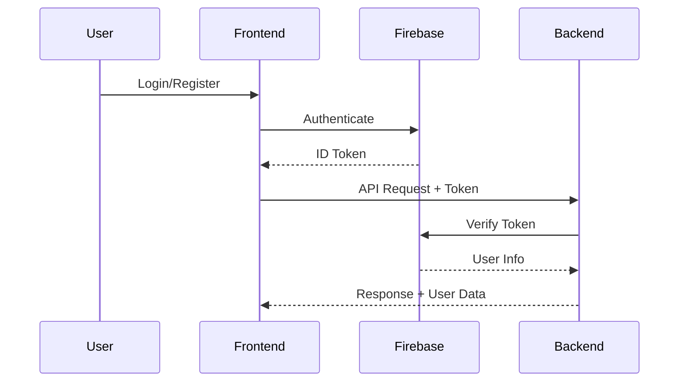
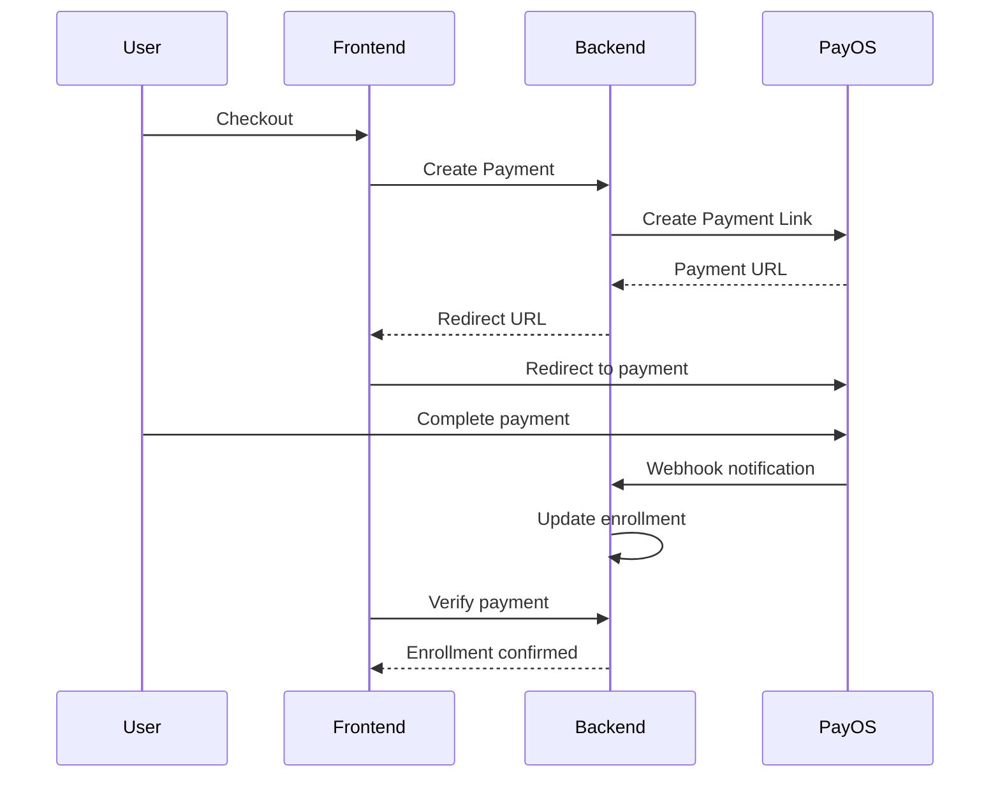

# 🏗️ Project Overview - Learning Lab

> **Project Name:** Learning Lab (nghe-content)  
> **Type:** Online Course Platform for Content Marketing  
> **Architecture:** Monorepo with Turborepo

---

## 📦 Tech Stack

### Monorepo Structure

```
nghe-content/
├── apps/
│   ├── backend/     # NestJS API server
│   └── frontend/    # Next.js web app
├── packages/
│   ├── eslint-config/  # Shared ESLint config
│   ├── types/          # Shared TypeScript types
│   └── utils/          # Shared utilities
└── package.json        # Root workspace config
```

### Backend

| Technology | Version | Purpose |
|------------|---------|---------|
| **NestJS** | 11.0.1 | API Framework |
| **Prisma** | 7.1.0 | ORM & Database toolkit |
| **PostgreSQL** | Latest | Database |
| **Firebase Admin** | 13.6.0 | Authentication |
| **PayOS** | Custom | Payment Gateway (VN) |
| **Jest** | 30.0.0 | Testing framework |
| **Artillery** | 2.0.27 | Performance testing |

### Frontend

| Technology | Version | Purpose |
|------------|---------|---------|
| **Next.js** | 16.0.7 | React Framework |
| **React** | 19.2.1 | UI Library |
| **Tailwind CSS** | 3.4.15 | Styling |
| **Zustand** | 5.0.9 | State Management |
| **TanStack Query** | 5.90.12 | Data Fetching |
| **Firebase** | 12.6.0 | Client Auth |
| **Lucide React** | 0.454.0 | Icons |

### DevOps & Tooling

| Tool | Purpose |
|------|---------|
| **Turborepo** | Monorepo build system |
| **GitHub Actions** | CI/CD automation |
| **Husky** | Git hooks |
| **Prettier** | Code formatting |
| **ESLint** | Linting |

---

## 🎨 Design System

### Color Palette

| Color | Hex | Usage |
|-------|-----|-------|
| **Primary** | #0D9488 (Teal) | Main brand color |
| **Secondary** | #2DD4BF (Aqua) | Supporting elements |
| **Accent** | #EA580C (Orange) | CTAs, highlights |

### Design Principles

- ✅ **Glassmorphism** - Modern glass-like UI elements
- ✅ **Micro-animations** - Smooth hover & transition effects
- ✅ **Dark mode support** - prefers-color-scheme
- ✅ **Accessibility** - ARIA labels, reduced motion support
- ✅ **Responsive** - Mobile-first approach

---

## 🔐 Authentication Flow



---

## 💳 Payment Flow (PayOS)



---

## 📊 Database Overview

- **11 tables** in PostgreSQL
- **Primary entities:** User, Course, Lesson, Enrollment, Payment
- **Supporting:** Category, Media, Progress, Review, CartItem
- See [DATABASE_SCHEMA.md](./DATABASE_SCHEMA.md) for full schema

---

## 🌐 API Structure

Base URL: `http://localhost:3001/api`

| Module | Endpoints | Auth Required |
|--------|-----------|---------------|
| `/auth` | Login, Register, Profile | Partial |
| `/categories` | CRUD categories | Admin only |
| `/courses` | CRUD courses, Search | Partial |
| `/lessons` | CRUD lessons | Enrolled users |
| `/enrollments` | Manage enrollments | User |
| `/payments` | Process payments | User |
| `/cart` | Shopping cart | User |
| `/progress` | Track learning | User |
| `/media` | Media management | Instructor |
| `/users` | User management | Admin |
